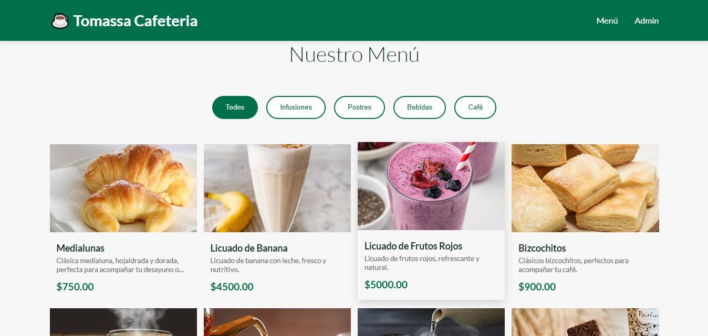
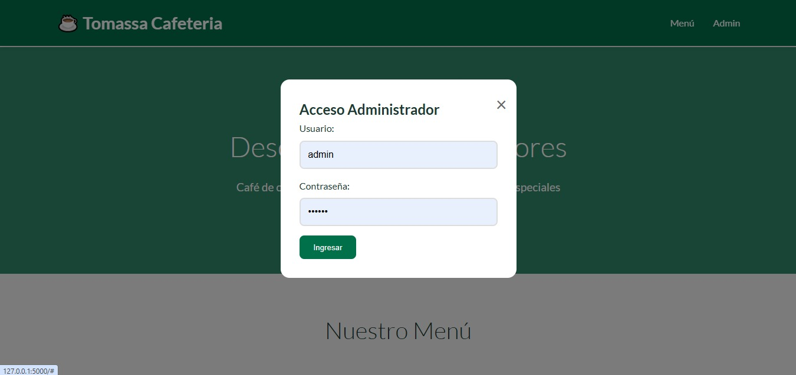
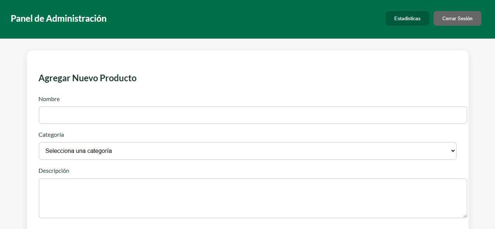
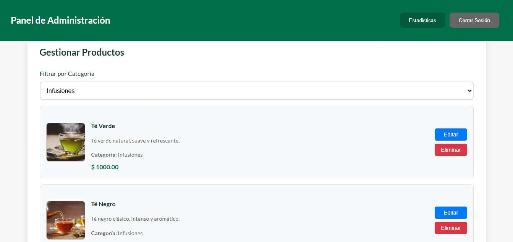

# Menú Digital - Tomassa Cafetería

## Descripción

Menú digital para cafetería que permite a los clientes explorar productos de manera visual y sencilla, y a los administradores gestionar la información del menú.

**Cliente:**

- Visualiza imágenes y precios de los productos.

- Filtra productos por categorías.

**Administrador:**

- Accede mediante un login.

- Puede agregar, editar y eliminar productos.

- Visualiza estadísticas de productos.

 

  

## Tecnologías utilizadas

- Backend: Python, Flask

- Frontend: HTML, CSS, JavaScript

- Base de datos: SQL Server

- Librerías: pyodbc, hashlib, base64, pandas, matplotlib
